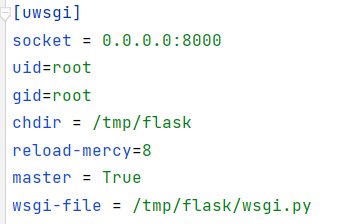
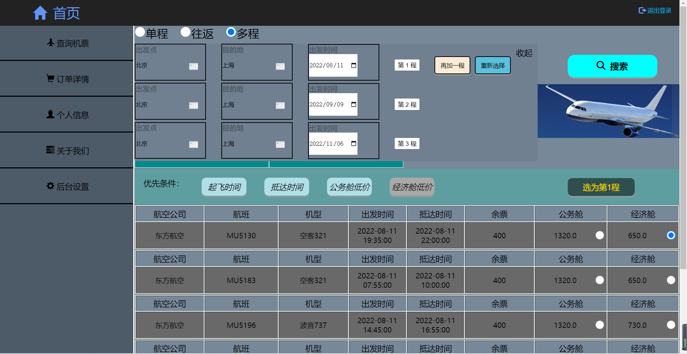
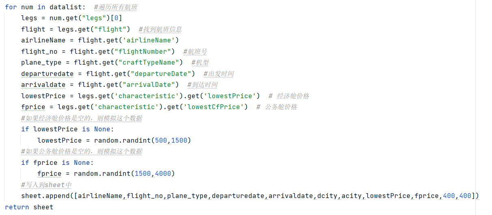
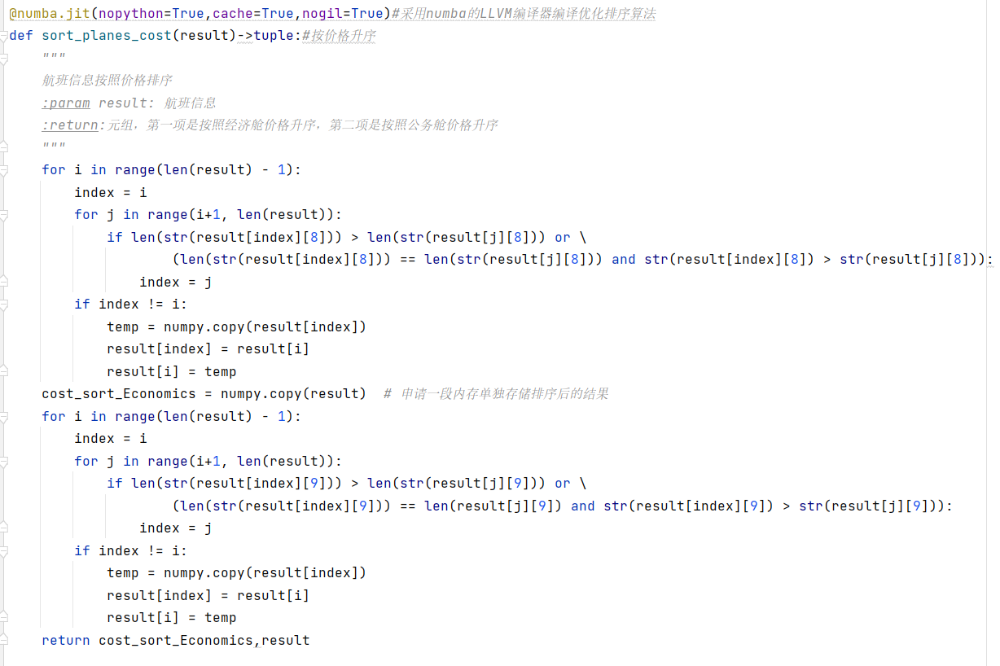
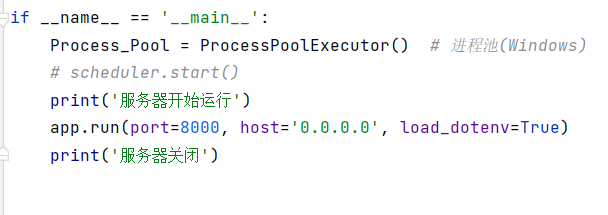
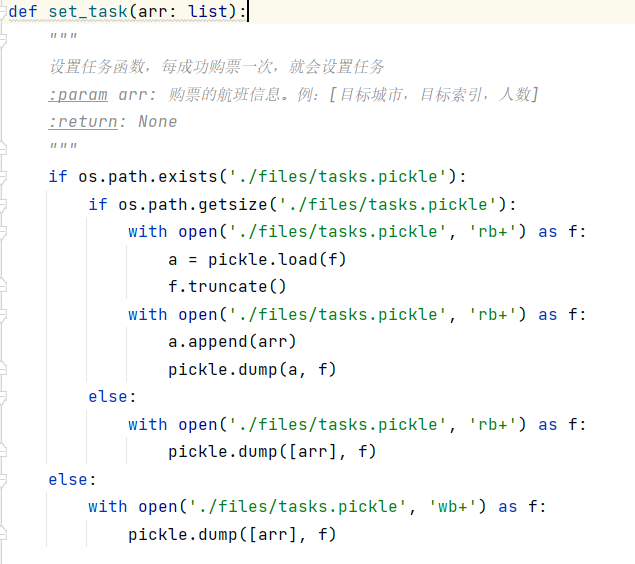
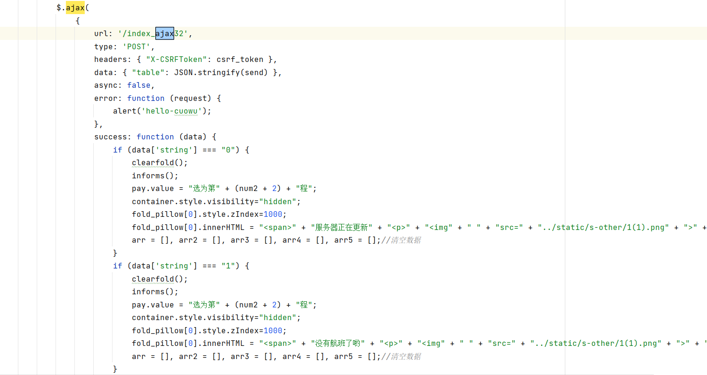

# 民航行程推荐
[网址：点击进入](http://www.planeinfo.top) http://www.planeinfo.top<br>
[仓库地址：点击进入](https://gitee.com/April_Zhao/web) https://gitee.com/April_Zhao/web <br>


#### 介绍
2022界软件杯A1赛题
项目部署在华为云服务器，网址如上 <br>
服务器使用操作系统-Linux Ubuntu 20 <br>


#### 软件架构 <br>
软件架构说明 <br>
1、开发语言：Python，解释器版本3.8.10； <br>
2、web后端使用Flask框架编写； <br>
3、B/S前后端分离； <br>
4、使用openpyxl与requests模块爬取携程网机票数据并存储Excel表格； <br>
5、机票信息最终以二进制形式存储； <br>
6、使用pandas库对机票信息（二进制）进行增删改查； <br>
7、使用Python高层API进程池、线程池实现高并发，加快机票筛查速度。 <br>


#### 安装教程

1.  部署项目到服务器 <br>

推荐放到家目录,打开服务器时用当前用户的权限，而不是直接root。
```
cd /home/xxx
```

```
git clone https://gitee.com/April_Zhao/web.git
```


2.  配置Python环境(root) <br>
更新pip `python3 -m pip install --upgrade pip` <br>
安装项目相关模块 `pip install -r requirements.txt` <br>


3.  配置nginx反向代理 <br>
安装nginx `apt install nginx` <br>
更改配置文件 <br>

```
rm /etc/nginx/sites-enabled/default
```

```
cp ./flask /etc/nginx/sites-enabled/flask
```
开放端口22/80/443/465
发送邮件时使用了smtp协议，因此请务必开放465端口

```
ufw allow 32
ufw allow 80
ufw allow 443
ufw allow 465
ufw enable
ufw status
```
检测nginx配置文件是否正确编写

```
nginx -t
```
若出现“ok”，“successful”字样则说明配置文件没有错误 <br>
如果一切正常，请务必重启Nginx让配置文件生效 <br>

```
service nginx restart
```

4、打开服务器 <br>
安装uwsgi独立容器

```
pip install uwsgi
```
修改wsgi.ini配置文件的内容 <br>
 <br>
将其中chair处改为项目的目录路径，wsgi-app处改为wsgi.py文件的路径；二者都是用绝对路径。


在项目当前目录下打开uwsgi

```
uwsgi --ini wsgi.ini
```
注意1：最好不要用root打开容器，权限太高会有安全隐患，最好使用用户自己的权限，如`su zhao`即可。因为不使用root权限，因此files目录以及里面的文件应当给予权限，使用chmod命令给予用户读和写的权限。

注意2：项目中有若干隐藏文件，为外置环境变量的存放地，可以使用`ls -l`的命令查看，不影响使用。
<br>

5、关闭服务器

```
pkill -f wsgi -9
```
查看wsgi相关进程

```
ps aux | grep wsgi
```


#### 使用说明

1.  复制网址并在浏览器打开，会进入到登录页面

如果账号已注册则可以直接登录，输入邮箱后等待民航推荐网站发送邮件到你的邮箱，然后将邮件里的六位密码写入“验证码”处即可。 <br>
如果账号未注册，则可以点击"前往注册"进行账号注册;若账号已经注册则不能重复注册，会有提醒；若未注册则同登录操作;注册完成后可以进行登录操作。<br>

2.  进入主页面

如图所示，就是航班行程推荐的主页面。点击退出登录可以退出登录，左侧仅有查询机票按钮有效，其余按钮则只是装饰。

3.  机票搜索
如上图所示，可以点击“单程”、“往返”、“多程”中的任意一个进行机票搜索，其中，默认选择了“单程”。
①单程
需要选择出发城市、到达城市和出发时间，点击搜索进行搜索。

如图所示：机票信息在后端搜索若干秒后返回信息。有“起飞时间”、“抵达时间”、“公务舱低价”、“经济舱低价”四个选项，用户可以选择适合自己的机票，以”经济舱低价“为例，选择之后点击预定即可。
点击预定之后进入支付页面。

②往返<br>
往返则是要把“去程”和“返程”两个都选择好之后才能点击“预定”。<br>

③多程<br>

点击“再加一程”可以多出一个选择框，将信息分别填入；如果不需要那么多选择框可以点击“重新选择”变回原样。如果点击搜索后对当前的机票都不满意想重新选择，请务必点击“重新选择”或者刷新将一切变回原样。<br>

4、购买机票

在支付页面，用户可以通过输入邮件来实现多用户购买同程的机票，为了方便起见，添加的乘客信息不需要注册。
若对选择的机票与价格没有异议，则可以点击支付，在弹出”支付成功“后，用户则会收到一封邮件。


 **注：如果遇到了非正常情况，可以刷新浏览器。** 


<br>
<br>

### 阅读源代码指南
项目目录如下<br>

1、Spider.py是机票爬虫程序；<br>
2、wsgi.py是项目的Python后端源码，前后端交互相关代码在此文件中；<br>
3、Function.py是外置的函数库，将部分函数和类外置，避免wsgi.py过于臃肿；<br>
4、requirements.txt是项目需要和依赖的Python第三方模块；<br>
5、wsgi.ini是uwsgi独立容器的配置文件;<br>
6、flask文件是nginx的配置文件；<br>
7、.env是后端外置的环境变量；<br>
8、templates目录下是前端模板，所有的html文件都在这个目录下；<br>
9、static是前端所需资源。其中，s-css目录中包含所有的css文件；s-js目录中包含所有的js文件；<br>
10、files目录下是项目需要的资源。其中，citys目录下是二进制机票信息；logs是项目的日志（仅记录报错信息排查错误用）emails.pickle文件记录网站的用户信息；tasks.pickle记录定时任务信息。test/test_citys是机票信息的文本版。<br><br>


### 实现原理和技术细节


1、航班信息获取

使用爬虫从携程网爬取常见城市一年的机票数据（从2022年6月到2023年5月）。由于要爬取的机票的信息量较大，因此有 <br><br>

2、航班信息存储 <br>
航班信息最终以二进制形式存储，在./files/citys/目录下 <br>
使用pandas库对二进制数据进行读写，速度约比直接读写.xlsx(Excel)文件快40倍。软件杯赛题中规定：“所有数据的原始数据都是纯文本”，但是我通过实践得知：直接读写纯文本速度较慢，因此我最终使用了Python标准库中用于序列化的pickle二进制格式来存取数据。以出发城市作为文件名，如北京到其它城市的航班信息都保存在北京.pickle文件中。
这里与软件杯的赛题并不契合，可能现实中并不会这么做，不过私以为只要实现了功能（哪怕只有部分），这么做也无伤大雅。项目中./files/test/test_citys中的.xlsx文件为航班信息的原始数据，是参考用的文本文件。 <br>

3、数据的筛查

使用pandas库的筛选功能，打开出发城市对应的文件，筛选出指定到达城市和出发实践的若干条数据并返回一个二维列表。

机票数据筛选出来后再进行排序（选择排序），根据前端的界面可以看到，共有四个排序，“起飞时间”、“抵达时间”、“公务舱价格”、“经济舱价格”，其中“起飞时间”、“抵达时间”放在一个函数里执行，其余放在如图所示函数里执行。其中，使用LVMM编译器在nopython状态下编译运行函数体可以有效加快排序的速度，约比不使用Jit快了10倍左右。<br>

4、进程池、线程池的应用
其实在软件杯赛题与解析中，曾有这样的表述：现实情况下机票信息非常复杂，如果使用了多进程、多线程来运行，将会占用过量的服务器资源，因此不要这么用。但是我为了加快程序运行速度、优化用户体验，仍然使用了进程池与线程池。<br>

 <br>
如图所示，有两个地方引入了进程池。但二者并不冲突。在main函数里引入的进程池是在Windows环境下开发时使用的，由于Windows与Liunx多进程底层实现不同，因此将Windows引入ProcessPoolExecutor放在了主函数里。并且在Linux下并不是直接简单地执行程序，而是由Uwsgi（独立容器）实现，因此在Linux环境下不会执行主函数。<br>

5、机票数据更新<br>
每次用户购买机票之后，会设置一个任务，每个任务都包含三个信息，【出发城市，目标索引，人数】。

然后每隔6个小时会对数据库里的机票余座信息进行更新。

根据任务里的出发城市打开对应文件，通过目标索引找出索引对应的那条记录，余座减去人数。<br>
<br>
设置定时任务。

6、前后端交互
<br>
前后端使用ajax交互，前端将用户的需求传给后端，后端处理之后，将数据返回给前端展示


#### 参与贡献

1、队长：赵飞扬<br>
2、队员：谷泽铜
<br>


